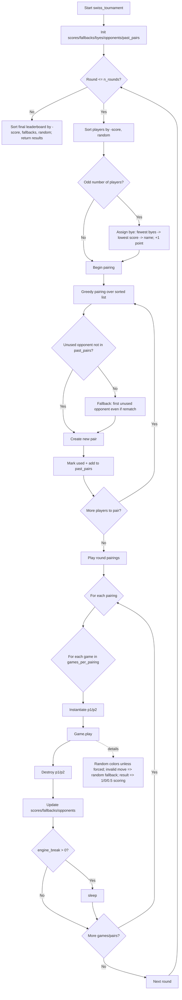

```mermaid
flowchart TD
  A[Start swiss_tournament] --> B[Init scores/fallbacks/byes/opponents/past_pairs]
  B --> C{Round <= n_rounds?}
  C -- No --> Z[Sort final leaderboard by -score, fallbacks, random; return results]
  C -- Yes --> D[Sort players by -score, random]
  D --> E{Odd number of players?}
  E -- Yes --> F[Assign bye: fewest byes -> lowest score -> name; +1 point]
  E -- No --> G[Begin pairing]
  F --> G
  G --> H[Greedy pairing over sorted list]
  H --> I{Unused opponent not in past_pairs?}
  I -- Yes --> J[Create new pair]
  I -- No --> K[Fallback: first unused opponent even if rematch]
  K --> J
  J --> L[Mark used + add to past_pairs]
  L --> M{More players to pair?}
  M -- Yes --> H
  M -- No --> N[Play round pairings]

  N --> O{For each pairing}
  O --> P{For each game in games_per_pairing}
  P --> Q[Instantiate p1/p2]
  Q --> R[Game.play]
  R --> S[Destroy p1/p2]
  S --> T[Update scores/fallbacks/opponents]
  T --> U{engine_break > 0?}
  U -- Yes --> V[sleep]
  U -- No --> W{More games/pairs?}
  V --> W
  W -- Yes --> O
  W -- No --> X[Next round]
  X --> C

  R -. details .-> R1[Random colors unless forced; invalid move => random fallback; result => 1/0/0.5 scoring]
```
