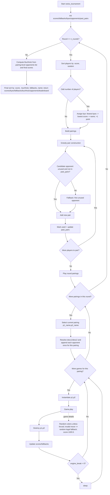

# Notes

You can visualize the diagram e.g. by pasting it in [mermaid.live](https://mermaid.live/) or via VSCode plugin `bierner.markdown-mermaid`.

## Swiss-style tournament

```mermaid
flowchart TD
  A[Start swiss_tournament] --> B[Init scores/fallbacks/byes/opponents/past_pairs]
  B --> C{Round <= n_rounds?}
  C -- No --> Y[Compute Buchholz from pairing-level opponents list and final scores]
  Y --> Z[Final sort by -score, -buchholz, fallbacks, name; return scores/byes/fallbacks/buchholz/opponents/leaderboard]
  C -- Yes --> D[Sort players by -score, random]
  D --> E{Odd number of players?}
  E -- Yes --> F[Assign bye: fewest byes -> lowest score -> name; +1 point]
  E -- No --> G[Build pairings]
  F --> G
  G --> H[Greedy pair construction]
  H --> I{Candidate opponent unused and not in past_pairs?}
  I -- Yes --> J[Add new pair]
  I -- No --> K[Fallback: first unused opponent]
  K --> J
  J --> L[Mark used + update past_pairs]
  L --> M{More players to pair?}
  M -- Yes --> H
  M -- No --> N[Play round pairings]

  %% Outer loop: pairings
  N --> O{More pairings in this round?}
  O -- No --> C
  O -- Yes --> P[Select current pairing p1_name,p2_name]
  P --> Q[Resolve desc1/desc2 and append each opponent once for this pairing]

  %% Inner loop: games within one pairing
  Q --> R{More games for this pairing?}
  R -- No --> O
  R -- Yes --> S[Instantiate p1,p2]
  S --> T[Game.play]
  T --> U[Destroy p1,p2]
  U --> V[Update scores/fallbacks]
  V --> W{engine_break > 0?}
  W -- Yes --> X[sleep]
  W -- No --> R
  X --> R

  T -. game details .-> G1[Random colors unless forced; invalid move => random legal fallback; score 1/0/0.5]
```
